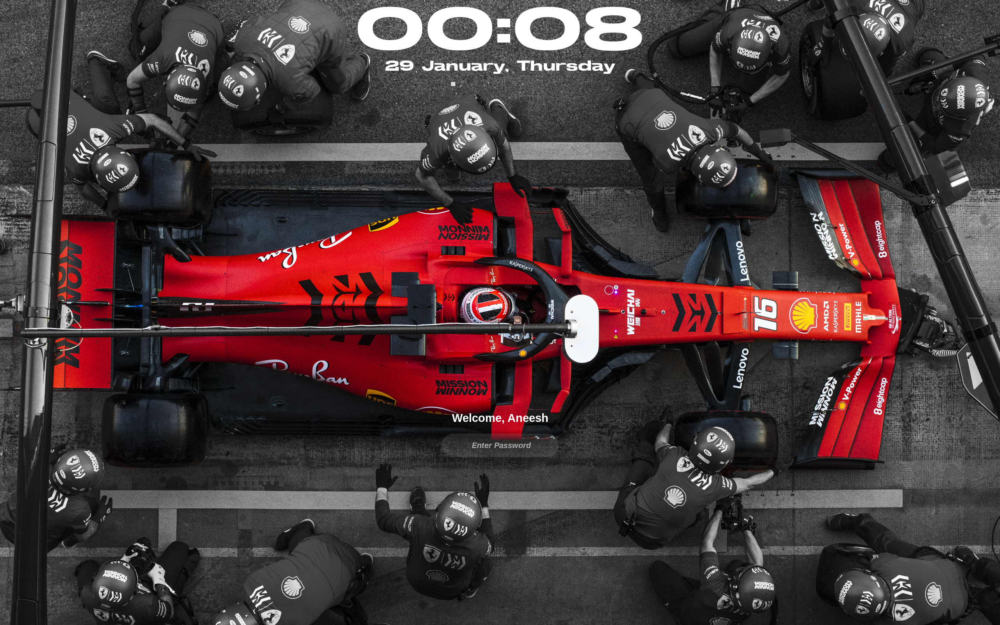
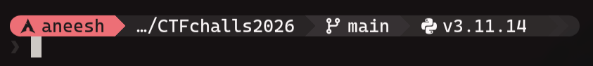

# Arch Linux Configuration

> My Personal Arch Linux configuration featuring Hyprland, Waybar, Alacritty, and custom themes.


<div align="center">
  
</div>

<div align="center">
  
</div>

<div align="center">
  
</div>

<br>

**Configuration:** [`verticalSetup/`](verticalSetup/) • [`themes/nes/`](themes/nes/)

---

## Horizontal Waybar with Icons

> Horizontal Waybar with Application Icons

<div align="center">
  
</div>

<br>

**Configuration:** [`waybar/`](waybar/)


---

## Hyprlock

> Custom F1 lock screen configuration 

<div align="center">
  
</div>

<br>

**Configuration:** [`hypr/hyprlock.conf`](hypr/hyprlock.conf)


---


## Starship 

> Custom Starship.toml configuration.

<div align="center">
  
</div>

<br>

**Configuration:** [`starship/starship.toml`](starship/starship.toml)


---

## Wallpapers

<div align="center">
  <table>
    <tr>
      <td align="center" width="33%">
        
        <br><b>Kame</b>
      </td>
      <td align="center" width="33%">
        
        <br><b>Samurai</b>
      </td>
      <td align="center" width="33%">
        
        <br><b>Daniel C</b>
      </td>
    </tr>
    <tr>
      <td align="center" width="33%">
        
        <br><b>Ferrari</b>
      </td>
      <td align="center" width="33%">
        
        <br><b>Night City</b>
      </td>
      <td align="center" width="33%">
        
        <br><b>Raiden</b>
      </td>
    </tr>
  </table>
</div>

<br>

**All wallpapers:** [`wallpapers/`](wallpapers/)

---


## Directory Structure

```
alacritty/          Terminal configuration
hypr/               Main Hyprland configuration
waybar/             Status bar configurations
  ├─ mechabar/      Modern modular waybar
  ├─ custom/        Custom waybar setup
  └─ original/      Original configurations
themes/             Theme collections
  ├─ nes/           NES retro theme
  └─ void/          Void theme
starship/           Shell prompt configuration
tmux/               Terminal multiplexer
verticalSetup/      Vertical monitor configuration
limine/             Bootloader configuration
wallpapers/         Wallpaper collection
```


---

