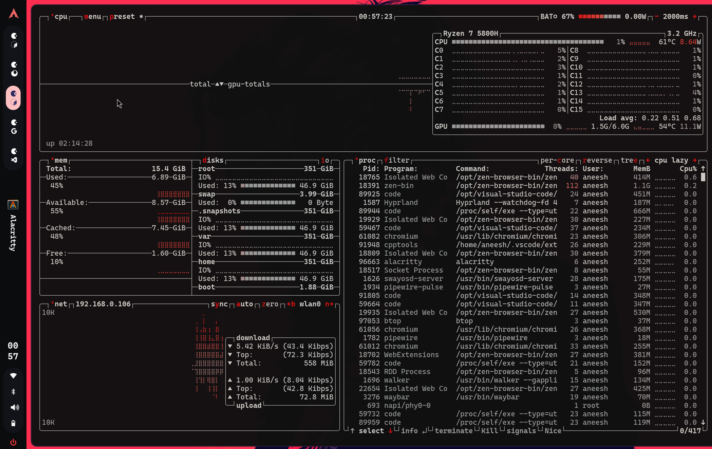
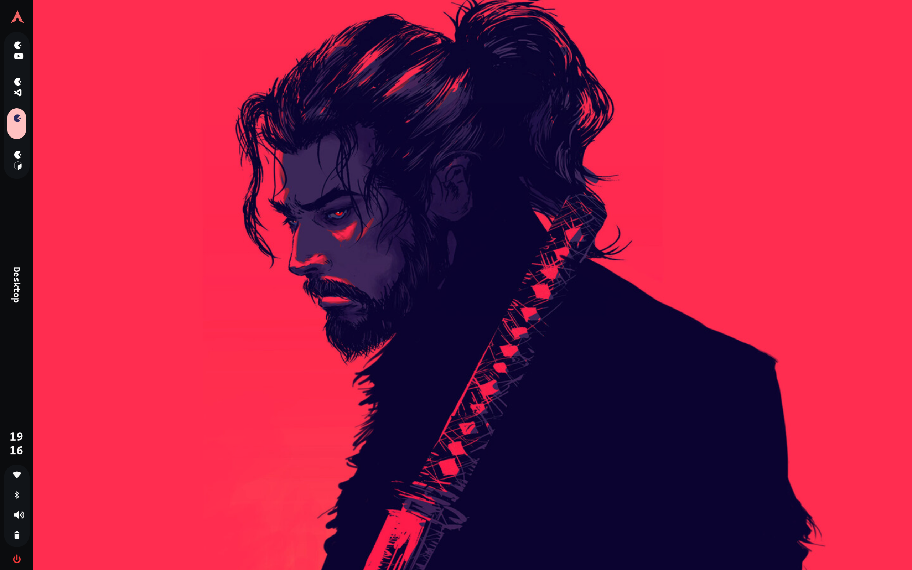
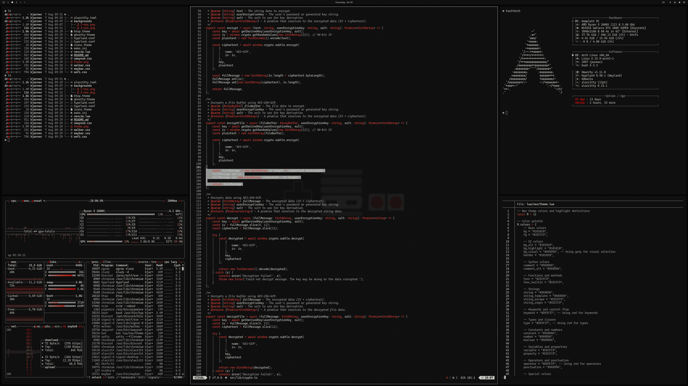
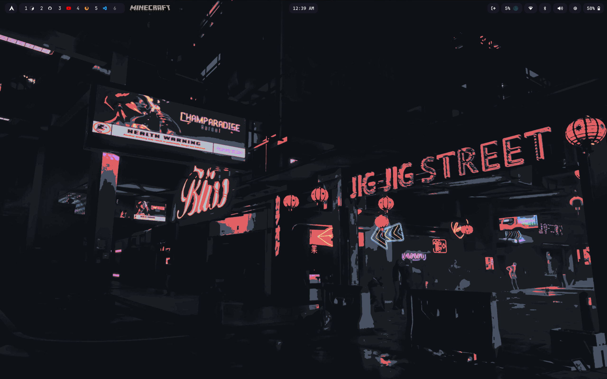
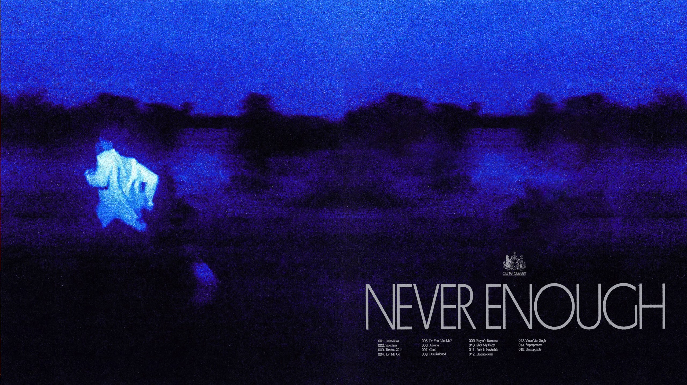
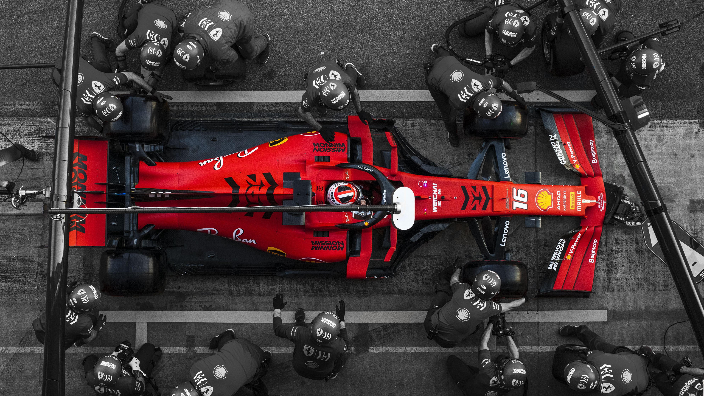

# Arch Linux Configuration

My personal Arch Linux configuration featuring Hyprland, Waybar, Alacritty, and custom themes.

---

## 🖥️ Vertical Setup

A vertical monitor configuration optimized for productivity.

  
  

📁 Configuration: [`verticalSetup/`](verticalSetup/)

---

## 🎨 Current Theme - NES

Retro NES-inspired theme with pixel-perfect aesthetics.

  

📁 Configuration: [`themes/nes/`](themes/nes/)

---

## 🔄 Previous Setup - Horizontal Waybar with Icons

Clean horizontal Waybar configuration with icon-focused design.

  

📁 Configuration: [`waybar/`](waybar/)

---

## ⭐ Starship Prompt

Custom Starship prompt configuration for enhanced terminal experience.

📁 Configuration: [`starship/starship.toml`](starship/starship.toml)

---

## 🌄 Wallpapers

  <table>
    <tr>
      <td align="center">
         
        <b>Kame</b>
      </td>
      <td align="center">
         
        <b>Samurai</b>
      </td>
      <td align="center">
         
        <b>Daniel C</b>
      </td>
    </tr>
    <tr>
      <td align="center">
         
        <b>Ferrari</b>
      </td>
      <td align="center">
         
        <b>Night City</b>
      </td>
      <td align="center">
         
        <b>Raiden</b>
      </td>
    </tr>
  </table>

📁 All wallpapers: [`wallpapers/`](wallpapers/)

---

## 📂 Directory Structure

- **[`alacritty/`](alacritty/)** - Terminal emulator configuration
- **[`hypr/`](hypr/)** - Hyprland window manager configuration
- **[`waybar/`](waybar/)** - Status bar configurations
- **[`themes/`](themes/)** - Theme collections (NES, Void)
- **[`starship/`](starship/)** - Shell prompt configuration
- **[`tmux/`](tmux/)** - Terminal multiplexer configuration
- **[`limine/`](limine/)** - Bootloader configuration
- **[`verticalSetup/`](verticalSetup/)** - Vertical monitor setup

---

## 🚀 Quick Links

- Main Hyprland Config: [`hypr/hyprland.conf`](hypr/hyprland.conf)
- Waybar Mechabar: [`waybar/mechabar/`](waybar/mechabar/)
- NES Theme: [`themes/nes/`](themes/nes/)
- Void Theme: [`themes/void/`](themes/void/)

---

**Enjoy your setup!** 🎉
